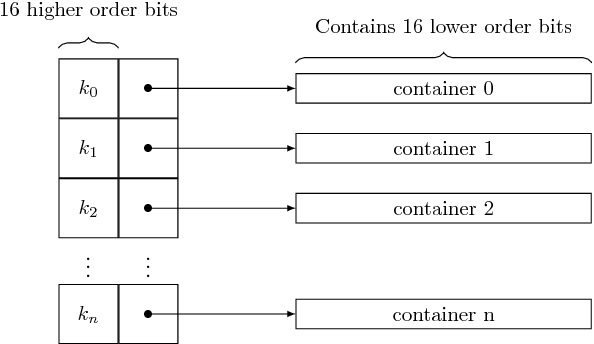
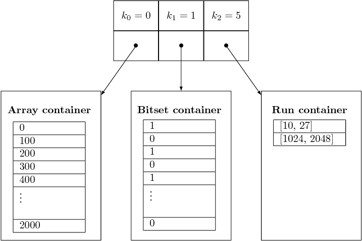

# Roaring analysis

This project is a performance analysis of implementations of **Roaring Bitmaps**. We will focus on one operation: the union between two roaring bitmaps.
This takes place in the Scientific Methodology and Performance Evaluation (SMPE) course of the Grenoble Alpes University.

  - C implementation: https://github.com/RoaringBitmap/CRoaring
  - Cython implementation: https://github.com/andreasvc/roaringbitmap
  - Python wrapper for the C implementation: https://github.com/Ezibenroc/PyRoaringBitMap
  - SMPE course: https://github.com/alegrand/SMPE

## About roaring bitmaps

Roaring bitmaps are a hybrid data structure to represent sets of unsigned 32 bits integers. Their main purpose is to be more efficient, both in memory and in computation time, than classical set implementations like hash sets. They are also more versatile than bitsets, which should not be used when the elements are “too sparse”.

A roaring bitmap is made of a sorted array of “containers”. An element of a roaring bitmap will be represented in one of these containers, depending on its 16 higher order bits. The container will therefore hold the 16 lower order bits of the integer (thus, containers can be viewed as sets of unsigned 16 bits integers). The following figure gives a quick overview.



Three types of containers are used:

  - **Array containers:** a dynamic array, holding a sorted list of the elements.
  - **Bitset containers:** a bitset of 2^16 bits.
  - **Run containers:** a dynamic array, holding a sorted list of intervals.

The type of the container is chosen depending on the number of elements it holds. We recall that there can be at most 2^16 such elements, since these are 16 bits integers.

  - Array containers must hold less than 4096 values.
  - Bitset containers must hold more than 4096 values.
  - Run containers are preferred to the two previous containers when they would require more space than a run container.

The following figure gives an example of a roaring bitmap containing:
 - All the multiples of 100 in `[0, 2000]`.
 - All the multiples of 2 in `[2^16, 2*2^16[`.
 - All the numbers in `[5*2^16+10, 5*2^16+27]` and all the numbers in `[5*2^16+1024, 5*2^16+2048]`.



For more details on roaring bitmaps, read http://arxiv.org/abs/1603.06549

## About this work - C analysis

The root of this work is the C file [roaring_op.c](roaring_op.c). It can be compiled into an executable which takes as input several parameters (sizes, densities, optimizations), generates randomly two roaring bitmaps accordingly, computes their union and finally outputs the time spent to compute this union.

The Python scripts [preliminary_runner.py](scripts/preliminary_runner.py) and [size_density_runner.py](scripts/size_density_runner.py) are used to automatize the experiments, with the Python files [utils.py](scripts/utils.py) and [samplers.py](scripts/samplers.py) containing some common functions. One experiment consists in compiling both the library and the executable in the desired way, running `roaring_op` with the desired parameters and saving the results in a CSV file.

## About this work - Python analysis

Here, everything is done in the script [python_size_density_runner.py](scripts/python_size_density_runner.py), which also uses the files [utils.py](scripts/utils.py) and [samplers.py](scripts/samplers.py).

The idea is very similar to what we did for the C analysis, but simpler, since everything remains in Python.

## Reproduce this work

Dependencies:
  - R programming language
    * ggplot2 package
    * FrF2 package
  - Python programming language (version >= 3.5)
  - Jupyter notebook (for the analysis)
  - R kernel for Jupyter (for the analysis)
  - Cython (only for the Python part, not needed for the C part)

Laptop used to get the results:
  - CPU: Intel Core i7-5600U
  - RAM: 16GB
  - OS:  Ubuntu 16.04 (Linux 4.4.0-57, gcc 5.4.0)

Clone the repositories:
```bash
git clone --recursive https://github.com/Ezibenroc/roaring_analysis.git
```

To open the Jupyter notebooks:
```bash
jupyter notebook # then click on the desired notebook
```

Instructions to generate the result files are written in the two notebooks.

## [Preliminary C Analysis](preliminary_analysis.ipynb)

This is our first analysis of the C implementation. The aim is to find which factors have a significant impact on the performances.

## [Size and density C analysis](size_density_analysis.ipynb)

We have identified the different optimizations that have an impact on performances.

We will now analyze the performances of the C implementation of roaring bitmap unions for various sizes and densities.

## [Size and density Python analysis](python_analysis.ipynb)

Here, we analyze the performances of the Cython and Python implementations of roaring bitmaps, as well as the built-in set.
